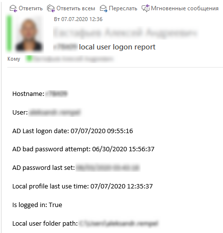

#  logonStatusTracker

- Version: 2.0
- Author: Alex Evstafiev
- Creation Date:  07.07.2019
- Purpose/Change: Security, User logon control
- PS Version: 5.0 

## Usage
    
The script collects local logged on user data, using Win32 classes (Computersystem, UserProfile) and AD user profile. Finaly, local machine, where script was started, sends email report (see on photo below). The final report provide access control for remote user and contains:
- target hostname
- username, working in current moment
- last bad password attempt timestamp
- password last set timestamp
- last use local profile timestamp
- logged in status
- current user home directory

## Setup

Send-MailMessage configration settings located in config.xml  
## Report example

## Scope

Control the technical persoanl in local department.
